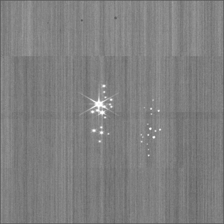

Bye Bye Pink Noise (BBPN)

1/f-noise reduction tool for JWST cal.fits images.

Demonstration
~~~~~~~~~~~~~

Installation & Documentation
~~~~~~~~~~~~~~~~~~~~~~~~~~~~

.. code-block:: bash

    pip install bbpn

or

.. code-block:: bash

    python install setup.py

Caveats
~~~~~~~

Good results will be obtained when a perfect segmentation mask is provided. 
However, this is not always the case for e.g. a crowded field or around regions aroung large galaxies.
If this tool seems to be over-subtracting background, turn ``f_sbtr_each_amp`` and/or ``f_sbtr_amp`` to False.

Examples
~~~~~~~~

.. code-block:: bash

    from bbpn import bbpn
    bbpn.run(cal_file)

Optional Arguments
~~~~~~~~~~~~~~~~~~
- ``file_seg``: Segmantation mask image for the input cal.fits file. If None, the module will try to find _seg.fits. Default None.
- ``plot_res``: Plot results from each step. Defaule False. 
- ``file_out``: Output file name. Default None.
- ``f_write``: Flag to write the output fits file. Default True.
- ``f_sbtr_each_amp``: Calculate and subtract 1/f noise at each of four amplifiers. Default True.
- ``f_sbtr_amp``: Subtract (non-1/f) bkg at each of four amplifiers. Default True.

